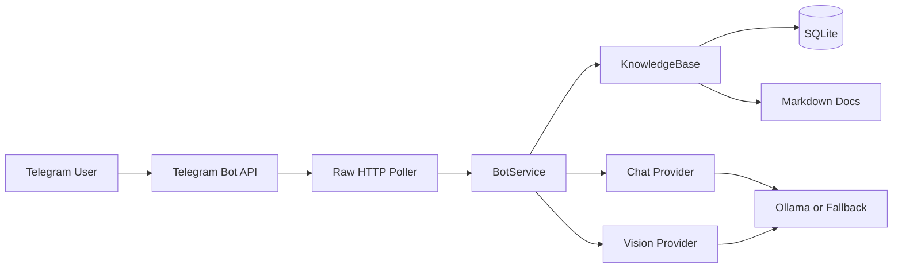

# Project RAG Vision Bot

`project-rag-vision-bot` is a lightweight hybrid Telegram bot that satisfies the assignment prompt with:

- `/ask <query>` for document-grounded answers from a local knowledge base
- `/image` for image captioning and 3 generated tags
- `/help` for usage guidance
- `/summarize` for a compact summary of the last interaction
- SQLite-backed runtime state for cached answers, indexed chunks, and per-user history

The implementation is intentionally stdlib-first. Telegram uses the raw Bot API over HTTP, and the model layer is behind adapters so the project still compiles on a bare Python install.

## What Was Built

- `Telegram` bot transport with polling, command parsing, file download, and photo handling
- `Mini-RAG` pipeline with document loading, chunking, retrieval, source snippets, and SQLite persistence
- `Vision` pipeline with provider adapters for:
  - `ollama` as the recommended local/open-source path
  - `transformers_blip` as an optional local Hugging Face path
- Optional enhancements from the prompt:
  - last-3-turn message history
  - query caching
  - source snippets in RAG answers
  - `/summarize`
- `CLI mode` for local smoke testing without Telegram

## Project Layout

```text
.
├── app.py
├── knowledge_base/
├── rag_vision_bot/
│   ├── cli.py
│   ├── config.py
│   ├── knowledge.py
│   ├── models.py
│   ├── prompts.py
│   ├── providers.py
│   ├── services.py
│   ├── storage.py
│   └── telegram_bot.py
├── tests/
└── docs/
```

## How To Run

### 1. Local CLI smoke test

This works on bare Python because the default retrieval path uses the built-in keyword embedder and a deterministic fallback answerer if no LLM is available.

```bash
python3 app.py --cli
```

Example:

```text
/ask What is the leave carry-forward policy?
/summarize
```

### 2. Telegram bot mode

1. Create a bot token with `@BotFather`
2. Copy `.env.example` values into your shell environment or an `.env` loader of your choice
3. Export at minimum:

```bash
export BOT_TRANSPORT=telegram
export TELEGRAM_BOT_TOKEN=your-token
```

4. Run the bot:

```bash
python3 app.py
```

### 2.5. Add your own RAG documents

The bot indexes files from `knowledge_base/` by default, and it now scans subfolders recursively.

Supported file types:

- `.md`
- `.txt`
- `.json`

After adding or editing files, restart the bot so it rebuilds the index.

### 3. Full local-model setup with Ollama

Recommended for the assignment because it keeps both text and vision local:

```bash
ollama pull llama3.2:3b
ollama pull nomic-embed-text
ollama pull llava:7b

export EMBEDDING_PROVIDER=ollama
export LLM_PROVIDER=ollama
export VISION_PROVIDER=ollama

python3 app.py
```

### 4. Optional Hugging Face local vision backend

If you prefer BLIP instead of Ollama for image captioning:

```bash
pip install pillow transformers torch
export VISION_PROVIDER=transformers_blip
python3 app.py --cli
```

## Commands

- `/ask <query>`: answer from the local knowledge base
- `/image`: prompt the bot to wait for an image; uploading a photo also auto-triggers captioning when enabled
- `/help`: show command help
- `/summarize`: summarize the last interaction for the same user/chat

## Configuration

Important environment variables:

- `BOT_TRANSPORT`: `telegram` or `cli`
- `TELEGRAM_BOT_TOKEN`: required for Telegram mode
- `KNOWLEDGE_DIR`: folder to index for RAG documents; defaults to `./knowledge_base`
- `EMBEDDING_PROVIDER`: `keyword`, `ollama`, or `sentence_transformers`
- `LLM_PROVIDER`: `ollama` or `none`
- `VISION_PROVIDER`: `ollama`, `transformers_blip`, or `none`
- `OLLAMA_BASE_URL`: default `http://localhost:11434`
- `TOP_K`: number of retrieved chunks to use
- `ENABLE_HISTORY`, `ENABLE_CACHE`, `ENABLE_VISION`, `ENABLE_SUMMARIZE`

See [.env.example](./.env.example) for the full config contract.

## System Design



Runtime flow:

1. Incoming Telegram update is normalized into a command or an image event.
2. `/ask` queries retrieve top-k chunks from the local knowledge base and assemble a grounded prompt.
3. `/image` downloads the uploaded file and passes it to the configured vision backend.
4. Answers, cached results, and conversation history are stored in SQLite.

## Model Choices

- `RAG retrieval`: keyword hashing by default for zero-dependency smoke tests; `ollama` or `sentence-transformers` for stronger embeddings
- `LLM`: `ollama` is the recommended small-model runtime for local answers
- `Vision`: `llava` via Ollama is the recommended local multimodal path; BLIP is supported as an optional local alternative

This keeps the code deployable on a bare machine while still providing a credible local-model story for evaluation.

## Verification

Run the tests:

```bash
python3 -m unittest discover -s tests
```

Print a health report:

```bash
python3 app.py --doctor
```

## Demo Asset

A sample interaction transcript is included in [docs/demo_transcript.md](./docs/demo_transcript.md).
